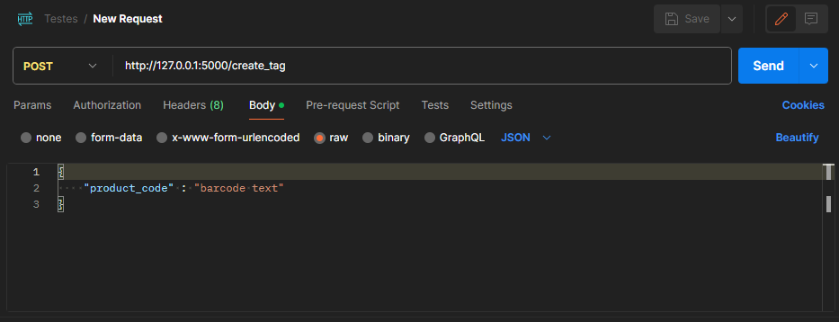
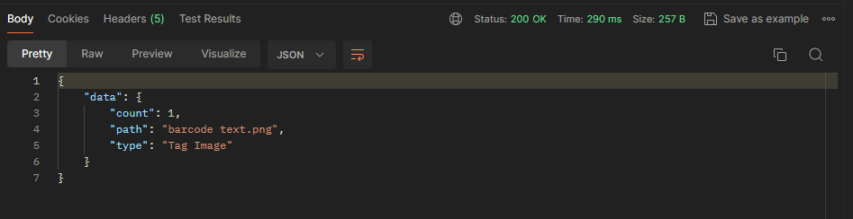

# Etiquetadora em python 🐍
Crie um `código de barra` a partir de qualquer input

## Tecnologias e frameworks
* Python
* Flask
* Virtualenv
* PyTest
* Pre-Commit
* PyLint
* Cerberus
* Pillow
* Python-Barcode

## Instalação
Instale usando o `git clone`
```
  git clone <url do repositório>
```

## Exemplo
Execute o arquivo `run.py` e aguarde o Flask abrir o servidor web
```
  python run.py
```
```
    * Serving Flask app 'src.main.server.server'
    * Debug mode: on
    WARNING: This is a development server. Do not use it in a production deployment. Use a production WSGI server instead.

    * Running on all addresses (0.0.0.0)
    * Running on http://127.0.0.1:5000
    * Running on http://192.168.0.11:5000
    Press CTRL+C to quit
    * Restarting with stat
    * Debugger is active!
    * Debugger PIN: 281-453-216
```

## Requisições
#### Para enviar as requisições, utilizaremos o `Postman`, mas você pode utilizar qualquer outro programa para testes de API's



#### Crie uma requisição `POST` para a url `http://127.0.0.1:5000/create_tag` e envie um JSON pelo body com os dados que você deseja transformar em código de barra. Siga o modelo a seguir:

```
  {
    "product_code" : "<sua string de preferência>"
  }
```
## Resposta
#### A resposta também retornará um `JSON` com algumas informações do código de barra


<br> <br>


* O código de barra poderá ser encontrado na pasta `"/barcodes/"`


